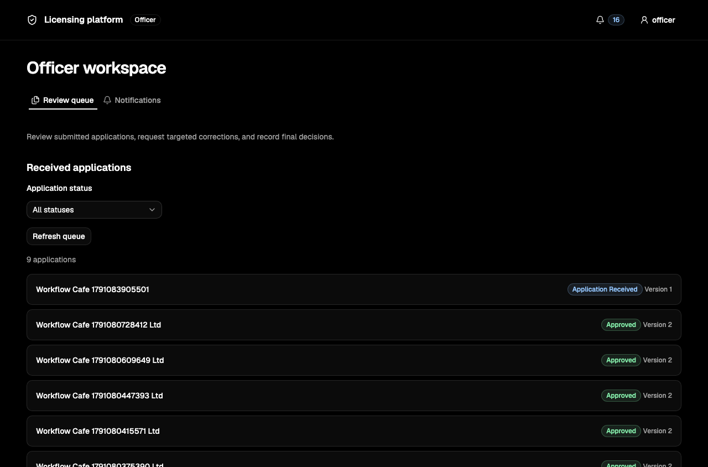
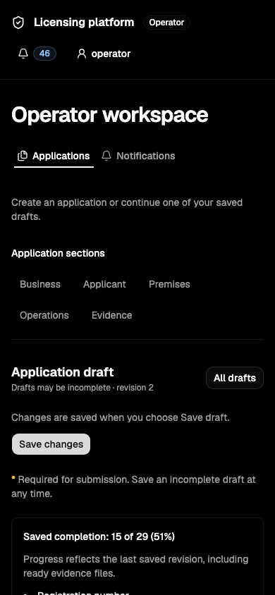

# Licensing platform UI research and review

Reviewed 4 October 2026 on `feature/core-review-workflow`, commit `f2d947b`.

The main problem is information architecture: the interface exposes most of the application lifecycle in a single growing card. Operators cannot reliably see what to do next, and officers must move between disconnected feedback, decision controls, snapshots, and history. Keep the existing dark shadcn design language; reorganise screens around the user’s current task before changing visual styling.

## Scope and evidence

The following audit records the interface before the implementation described below. Reviewed `App.tsx`, `Workflow.tsx`, API types, UI primitives, styles, existing tests, and the accepted product documents. Inspected the running application at `http://localhost:8081` as both seeded roles: application list, incomplete draft, submission panel, an open correction round, officer queue, submitted snapshot, history, and notifications. Used existing local test records; did not submit applications, publish corrections, decide cases, replace files, or mark notifications read. A temporary unsaved trading-name edit was discarded to reproduce navigation loss; no field data was saved.

Browser DOM observations included an actual 320 CSS-pixel viewport and a wider 1028 CSS-pixel viewport. The browser’s viewport override and rendered dimensions differed, so reported measurements use `innerWidth`, not requested viewport sizes. No document-level horizontal overflow was observed in those sampled views; clipped content inside a row still occurred. Screenshots were inspected during review. Officer action forms, empty/error states, and concurrency behavior were additionally reviewed in source; live publication/final-decision and network-failure experiments were not performed. This is a heuristic audit, not a user study or a complete WCAG certification.

All recommendations retain issue #25’s boundary: immutable uploads, simulated processing, initial submission, fixed targeted correction/resubmission rounds, explicit officer resolution, final decisions, history, and in-app notifications. Preserve strict alternation and server permissions. No automatic dependency unlock, completeness exception, inspections, issuance, payments, reopening, or separate approval routing is proposed here.

## Skills researched and installed first

Installed using the Codex skill-installer into `/Users/cyrus/.codex/skills`, outside this repository:

| Skill | Source and popularity evidence | Purpose here |
| --- | --- | --- |
| `web-design-guidelines` | [Vercel skill listing](https://skills.sh/vercel-labs/agent-skills/web-design-guidelines), approximately 696.5K installs shown when checked | Accessibility, forms, navigation, content handling, and interaction audit |
| `frontend-design` | [Anthropic skill listing](https://skills.sh/anthropics/skills/frontend-design), approximately 951.1K installs shown when checked | Deliberate hierarchy, typography, layout, and content review |
| `shadcn` | [Official shadcn skill documentation](https://ui.shadcn.com/docs/skills), from `shadcn-ui/ui/skills/shadcn` | Correct component selection and Base UI composition |

Install counts are registry snapshots, not independent quality assessments. These skills become automatically available on the next turn; their files were read manually for this audit. Also used the existing frontend UI engineering guidance. Applied the current [Vercel Web Interface Guidelines](https://github.com/vercel-labs/web-interface-guidelines/blob/main/command.md).

The official CLI confirms Vite, Tailwind v4, `base-nova`, Base UI, neutral theme, Geist, and Lucide. Installed primitives are Alert, Button, Card, Checkbox, Input, Label, and NativeSelect. There is no reason to migrate to Radix or replace the preset. The accepted [product specification](SPEC.md#core-screen-flows) calls for the black shadcn look; generic design-skill aesthetic suggestions do not override that choice. NativeSelect is already a shadcn component, not an accidental departure from it.

## Market research: typical flows

Research focused on official public guides and deployed government portals, rather than decorative dashboard galleries. These sources show useful patterns, but do not establish market share or prove that any competitor has superior usability.

| Reference | Observed pattern | Application to this product |
| --- | --- | --- |
| [GoBusiness new-licence guide, published by IRAS](https://www.iras.gov.sg/docs/default-source/annual-report/guide-for-new-licence-%282025%29.pdf?Status=Master&sfvrsn=98ea0c6_3) | My Submissions separates Action Required, Draft, Processing, and Completed; records show status, reference, updated time, and actions | Make applications identifiable and put outstanding work ahead of completed records |
| [GoBusiness action-required guide, published by LTA](https://onemotoring.lta.gov.sg/content/dam/onemotoring/Driving/pdf/VocationalLicence/Respond%20to%20Action%20Required%20%28RAR%29%20User%20Guide.pdf) | Action Required → edit requested information → respond to remarks/upload evidence → review form → declaration → submit | Use a dedicated corrections workspace with a clear review and resubmit sequence |
| [Santa Rosa’s Accela portal guide](https://www.srcity.org/3898/Online-Permitting-System-and-Digital-Pla) | Centralised project documents, responses to review comments, status, workflow steps, and history | Keep evidence and feedback attached to the case and its submitted version |
| [Cape Coral’s EnerGov/CSS navigation guide](https://www.capecoral.gov/departments/development_services/permitting_services_division/energov_citizen_self_service_css.php) | Dashboard gives an overview; Apply begins applications; My Work accesses existing records | Separate overview, work lists, and application detail rather than putting all functions in one surface |
| [GOV.UK complete-multiple-tasks pattern](https://design-system.service.gov.uk/patterns/complete-multiple-tasks/) | Group related work, label task completion, and provide a return point for longer transactions | Give the five existing application sections a compact task overview |
| [GOV.UK check-answers pattern](https://design-system.service.gov.uk/patterns/check-answers/) and [confirmation pattern](https://design-system.service.gov.uk/patterns/confirmation-pages/) | Review answers before sending; confirm success with a reference and next-step information | Add an explicit review/declare/submit journey and a receipt explaining whose turn comes next |

Recommended synthesis for our scoped product:

1. **Operator:** applications → application task overview → business/applicant/premises/operations/evidence → review saved answers → fresh declarations → submit → receipt/status.
2. **Corrections:** action-required case → fixed request list → requested target plus response → save → verify every request and all applicable evidence → review → fresh declarations → resubmit → receipt/wait for officer.
3. **Officer:** submitted-case queue → latest submitted case → start review → inspect data/documents → draft requests → review the full fixed set → publish, or record a reasoned final decision.
4. **Officer after resubmission:** compare submitted versions → explicitly resolve or prepare reissue for each outstanding request → publish another fixed round or decide.

This sequence is a design recommendation inferred from the sources and existing product rules. Competitor features beyond our scope are not adopted.

## Prioritised findings

P1 means fix before treating the core interface as ready for users. P2 means substantial usability improvement. P3 means supporting consistency or maintenance work. “Live” indicates reproduced in the running browser; “source” indicates code/document inspection.

| ID | Priority / evidence | Location | Issue and user impact | Recommended correction |
| --- | --- | --- | --- | --- |
| 01 | P1 / live + source | `App.tsx:923`, `App.tsx:1590` | No unsaved-change guard. Typing a trading name, clicking All drafts, and reopening restores the previous value without warning. Sign out also has no shared dirty-state protection. | Track dirty state; offer Save / Discard / Stay when leaving and protect reload/close. Preserve explicit save behavior. |
| 02 | P1 / live | `App.tsx:858`, `App.tsx:1428` | Submission and history inserts the workflow above the form without scrolling or moving focus. After clicking, the new panel was about 3,104 pixels above the viewport while focus remained on the triggering button. The action appears to do nothing. | Navigate to a distinct review screen or move focus to the opened panel and make the transition visible. |
| 03 | P1 / live + source | `Workflow.tsx:395`, `Workflow.tsx:157` | Officer feedback links to `#legalName`, but the officer snapshot has no matching ID. The observed link has no target. Operator field links scroll but do not explicitly focus their target. | Use role-specific target navigation into the snapshot or editor; provide stable IDs and intentional focus. |
| 04 | P1 / source | `Workflow.tsx:130`, `Workflow.tsx:548`, `Workflow.tsx:616` | Historical snapshot selection is independent of the action context. Review/decision controls continue to target the latest version while a user can inspect an older version below them. There is no prominent historical-context lock or warning. | Show the active submitted version in the case header. Make historical viewing read-only and require returning to latest before actions. Keep existing server revision/version checks. |
| 05 | P1 / source | `Workflow.tsx:616` | Irreversible final decisions use a select defaulting to Approve plus a single submit. There is no deliberate outcome selection or final confirmation naming the case/version. | Require choosing an outcome; review the explanation and show an AlertDialog confirming the final action against the latest version. |
| 06 | P1 / documented boundary | `App.tsx:665`, `Workflow.tsx:550`, `SPEC.md:79` | A requested tenure/role change can create mandatory evidence that was omitted from the fixed request set. The operator cannot upload it and completeness prevents resubmission. This is an existing product dead end, not a spacing defect. | Before publication, warn officers about dependent targets and let them include those targets explicitly while the set is still a draft. Explain an already blocked round honestly. A general recovery mechanism requires an accepted product decision; do not silently unlock or waive anything. |
| 07 | P2 / live | `App.tsx:779`, `App.tsx:1532`, `App.tsx:1583` | Login’s centered Card also contains the entire signed-in application. One incomplete draft plus 45 existing notifications produced an approximately 8,240-pixel document at the wider observed viewport. Save draft was around y=3,440 and Sign out around y=8,161. Page length varies with notification count. | Use an application shell, persistent account/navigation area, dedicated work list/detail views, and a separate notification surface. |
| 08 | P2 / live | `App.tsx:796`, `App.tsx:809` | Mobile application rows reserve unshrinkable width for status/revision. At 320 CSS pixels, the correction row’s name had zero width while its status span needed 282 pixels inside a roughly 255-pixel button. There is no page overflow, but identity disappears. | Stack identity and status on mobile; keep a readable name/reference. Use Table on desktop and Item-style rows on mobile. |
| 09 | P2 / live + source | `App.tsx:779`, `Workflow.tsx:711` | Operator list mixes drafts and final cases without filters/search. Officer list defaults to all statuses and shows only name/status/version; reference and updated time are absent despite available ID/updatedAt data. Identifying untitled records or the next case to review is difficult. | Add search, status groups, reference, updated time, and role-specific next action. Retain an explicit all-submitted view and final records. Avoid invented SLA/assignment columns. |
| 10 | P2 / live + source | `App.tsx:1324`, `App.tsx:1445` | Saved completion appears after all fields and opening hours. Save is beneath evidence and declaration reminders. There is no persistent indication that local edits are unsaved, and submission readiness is discovered through errors rather than a review summary. | Put a task summary and saved/unsaved indicator near the header; provide a reachable save action and explain unmet requirements before submission. Fresh declarations remain a separate final step. |
| 11 | P2 / live + source | `Workflow.tsx:375`, `Workflow.tsx:648`, `App.tsx:904` | Corrections show feedback, then declarations, then the full submitted snapshot/history, then the complete editor with mostly disabled controls. The one editable field can be far below its request and response. Old and active requests are rendered together. | Make each active request a task containing the officer explanation, relevant target, response, and save state. Put retained data/history behind separate views; resolved requests remain accessible. |
| 12 | P2 / live + source | `Workflow.tsx:763`, `Workflow.tsx:789`, `api.ts:339` | Notifications sit below current work, require manual refresh, and lack case navigation even though each has applicationId. Generic messages do not identify the application. Updates within a case do not refresh the mounted notification count. | Add header unread access, a separate list/sheet, application identity, and links to the relevant case. Refresh after workflow changes; retain recipient-specific read state. |
| 13 | P2 / source | `Workflow.tsx:550`, `Workflow.tsx:586`, `Workflow.tsx:406`, `Workflow.tsx:635` | Correction, response, reissue, and decision explanations allow 2,000 characters but use single-line Inputs. Review-request creation is detached from the field/document and shows the additional-evidence title even for other request kinds. | Use Textarea with helpful guidance; create requests from the relevant snapshot section/document and reveal only applicable inputs. Show a draft-round summary before publication. |
| 14 | P2 / source + live structure | `App.tsx:729`, `App.tsx:838`, `App.tsx:1114`, `Workflow.tsx:650` | Save errors have inline text but no focused error summary/first-error transition. Email/phone share a generic text Input without suitable type/autocomplete. User copy exposes OWNER, OPEN, AWAITING_REVIEW, command names, raw event detail keys, revisions, and byte counts. | Add linked error summaries and focus handling; use suitable input semantics; map internal values to plain labels while preserving existing scoped lifecycle terminology and traceability. |
| 15 | P2 / source | `App.tsx:795`, `Workflow.tsx:678`, `Workflow.tsx:137` | Selected application, version, and filters live only in React state. Browser Back, refresh, bookmarks, and notification links cannot reliably restore a specific case/view. | Represent navigation and view selection in URLs; use links for navigation and preserve list filters on return. Do not use hash anchors as a substitute for case routing. |
| 16 | P2 / source | `Workflow.tsx:683`, `Workflow.tsx:763`, `App.tsx:1521` | Officer/notification lists initialise as empty and do not distinguish loading from zero results. Empty history/queue/notifications have little guidance. A failed operator-list load has no dedicated retry control. | Compose Skeleton, Empty, and Alert with meaningful loading, no-results, failure, and retry behavior. Keep existing safe retries for unknown outcomes. |
| 17 | P3 / source | `App.tsx:1532`, `Workflow.tsx:157`, `frontend/index.html:1` | Repeated bordered field tiles, nested upload borders, oversized workspace shadow, no skip link, and forced dark mode without color-scheme/theme-color weaken consistency. Application headings stay generic even after selecting a business. | Keep dark neutral tokens/Geist; use quieter grouped summary rows, consistent density, a case-specific title, skip navigation, and native dark-control support. Verify contrast rather than assuming it passes. |
| 18 | P3 / source | `App.tsx`, `Workflow.tsx` | Two files contain most fetching, commands, navigation, conflict recovery, forms, and presentation. This makes screen restructuring and consistent state treatment harder. | Extract focused shell/list/editor/evidence/correction/review/history/notification components as each UI slice changes. Preserve working recovery and concurrency behavior; avoid a wholesale logic rewrite. |

## Recommended shadcn screen structure

| Surface | Structure and suitable official primitives |
| --- | --- |
| Sign-in | Keep the focused Card, labelled inputs, Button, Alert |
| Workspace shell | Sidebar or NavigationMenu, Breadcrumb, account DropdownMenu, notification trigger; Sheet navigation on mobile |
| Applications / officer queue | Search Input, status Tabs or Select, Table, Badge, Pagination when needed; stacked Item rows on mobile |
| Operator application | Case title/reference/status/next action; task overview; FieldGroup/Field and FieldSet for the five sections; explicit save state |
| Evidence | Grouped document Items with file metadata, applicability Badge, file picker/drop target, Progress, Alert, and retained-file access |
| Review and submission | Grouped saved-answer summary, unmet-requirement Alert, fresh declaration Checkbox controls, clear submit action, receipt |
| Corrections | Active request Items with target editor/document controls and Textarea response; request completion summary; separate retained data/history views |
| Officer review | Clearly identified latest Snapshot, organised data/documents, contextual request controls, draft-round summary, Textarea explanations, AlertDialog for final commitment |
| History and comparison | Version Select, changed-only toggle, grouped summary rows showing current/previous values, readable chronological events |
| Notifications | Header unread count and Sheet/separate page, case links, read state, Empty/Skeleton/Alert |

Use the current Base UI APIs and official CLI for components; inspect docs before adding them. Avoid a new bespoke visual system, animated marketing treatments, or an automatic preset migration. On mobile, prioritise readable identity, wrapping statuses, single-column tasks, and reachable actions. Tabs switch related views; actual lifecycle progress must still explain who can act next.

## Suggested implementation order

1. Fix silent edit loss, submission focus/navigation, broken officer anchors, historical-context actions, and final-decision confirmation.
2. Introduce URL navigation and a workspace shell; separate notifications and account controls from page content. Preserve auth/session behavior.
3. Improve application and officer lists with identity, status groups, search, update time, and mobile rows.
4. Organise operator tasks, explicit save state, evidence, review, declarations, and receipt.
5. Build corrections around active requested targets and officer review around contextual feedback and version comparison. Add dependent-target warnings only before publication; preserve the fixed-set boundary.
6. Finish accessible error/loading/empty states, plain labels, spacing, and responsive checks.

Validate each accepted slice against real user tasks: resume the correct application, understand unsaved changes, upload/replace evidence without losing edits, review and submit, address every fixed request, compare retained versions, resolve/reissue explicitly, and understand a final outcome. Include keyboard focus, Back/refresh, long names/statuses/filenames, narrow layouts, unknown-result recovery, and notification navigation. Existing unit coverage does not establish usability.

## Verification and limitations

- `npm --prefix frontend ci && npm --prefix frontend run check`: passed; 49 tests, lint/typecheck/coverage/build passed. Three pre-existing Fast Refresh lint warnings and one npm low-severity advisory were reported. Local shell used Node 26; the application image uses pinned Node 24.
- `cd backend && ./mvnw verify`: passed; 54 tests, zero failures/errors, nine skips, coverage gate passed. This local run is not verification of the skipped PostgreSQL-specific cases.
- `node scripts/check-markdown-links.mjs`: passed before the report; rerun after saving it.
- `docker compose up --build --wait`: images built; default frontend startup failed because another existing stack occupies 127.0.0.1:8080. Recovered using a temporary Compose override restoring this project’s previous 127.0.0.1:8081 binding; database, backend, and frontend became healthy. No other stack was stopped and no volumes were reset.
- Sampled browser console warning/error log was empty. No new end-to-end application-submission run, axe audit, screen-reader session, or performance trace was performed.

At the baseline audit stage, application code and workflow rules were unchanged. `LOCAL_HANDOFF.md` was already untracked and remains untouched. The user subsequently authorised the UI implementation and a draft PR.

## Implemented UI update

The approved follow-up replaces the enclosing signed-in Card with a black page and a wider workspace. A sticky header contains identity, a profile dropdown with sign-out, and a notification bell with unread count. Applications/review queue and notifications have separate tab views. Keeping both panels mounted preserves unsaved editor values when switching tabs. Counts refresh on workspace/view changes and explicit refresh/read actions; this does not add push notifications.

Application fields, opening-hour inputs, evidence, and submitted summary rows stack vertically on desktop and mobile. Section anchors provide local navigation; save controls and saved completion appear near the top. Required field labels show an amber `*` and one shared explanation, while screen readers retain the requirement text. Status, evidence applicability, correction state, and new notifications use semantic coloured shadcn Badges. Longer explanations use official Textarea controls. Opening submission moves focus to the workflow; officer feedback links now resolve to retained summary rows.

The baseline findings remain an audit trail, not a claim that this PR resolves every issue. Historical-version action safeguards, final-decision confirmation, unsaved exit confirmation for All drafts, URL routing, search/pagination, technical history copy, and dependent-target guidance remain follow-up work. No server permissions, fixed-round boundaries, completeness rules, or API behavior changed. Official shadcn Base UI components were added through its CLI; no framework or component-library migration was introduced.

### Final validation

- Frontend lint, typecheck, coverage, and production build: passed, 53 tests. Five Fast Refresh warnings (three existing and two generated component-export warnings); no lint errors.
- Backend verification: passed, 54 tests with nine skips; coverage gate passed. Backend sources were unchanged.
- Compose build/start: database, backend, and frontend healthy using this project's existing 8081 binding via a temporary local override. The separate stack on 8080 remains untouched.
- Manual browser geometry: measured 320px and 1440px widths, no horizontal overflow, black background, vertically ordered fields sharing one column. Profile menu, unread count, section links, and focus were inspected.
- Regression tests cover state-preserving navigation, unread-count updates after marking read, submission focus, and officer field/document link targets, alongside existing concurrency and workflow tests.
- Chromium end-to-end: all four tests passed, including keyboard authentication/sign-out, evidence upload and retained edits, two-tab conflict recovery, and a complete targeted correction/resubmission/resolution/approval flow. Sampled browser warnings/errors were empty.
- Markdown links and whitespace checks: passed.

### Verified screenshots

Desktop officer workspace:

Mobile operator workspace:

